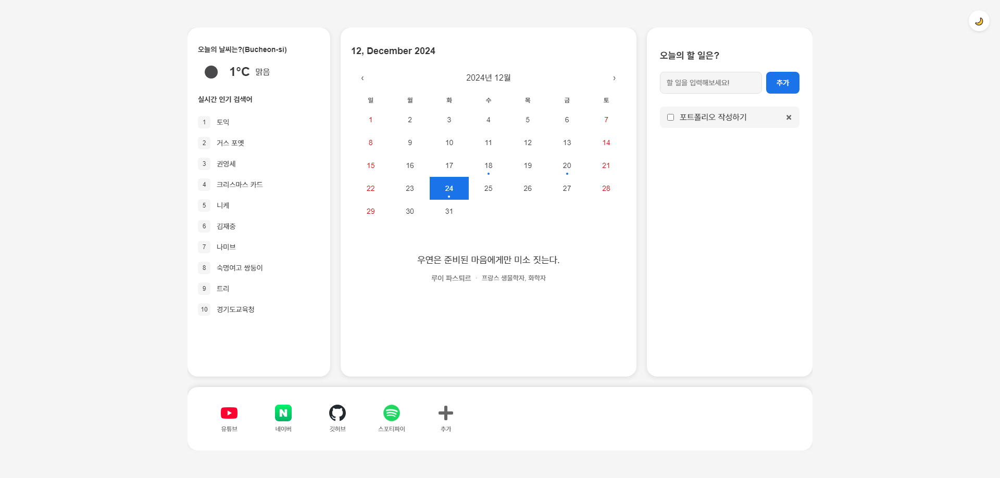

# [캘린더 앱](https://muswc.github.io/react_calendar)

할 일 관리와 날씨 정보를 제공하는 웹 애플리케이션입니다.

## 주요 기능

- 할 일 관리 (추가/삭제/완료)
- 캘린더 연동
- 날씨 정보 표시 
- 실시간 검색어 순위
- 북마크 관리
- 다크모드 지원

## 사용 기술

- React 19
- react-calendar
- OpenWeather API
- Google Trends API

## 문제

- 배포 환경에서 위치 정보를 가져오지 못하는 문제
- 1920x1080 외 해상도에서 화면이 깨지는 문제